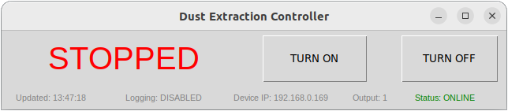

# Tasmota Controller GUI

Программа для управления устройствами на прошивке Tasmota через графический интерфейс с возможностью логирования и интернационализации.



## Основные возможности

- Управление реле (вкл/выкл)
- Отображение текущего состояния устройства
- Проверка соединения с устройством
- Поддержка аутентификации
- Логирование всех операций
- Многоязычный интерфейс
- Гибкая конфигурация

## Требования

- Python 3.7+
- Установленные пакеты:
```markdown
  pip install requests
  ```

## Установка

1. Склонируйте репозиторий:
   ```bash
   git clone https://github.com/ваш-репозиторий/tasmota-controller.git
   cd tasmota-controller
   ```

2. Установите зависимости:
   ```bash
   pip install -r requirements.txt
   ```

3. Настройте конфигурационные файлы (см. ниже)

## Конфигурация

### Основной конфигурационный файл (`config.json`)

```json
{
    "device_ip": "192.168.0.1",
    "output": 1,
    "poll_interval": 5,
    "username": "admin",
    "password": "password",
    "logging": false,
    "language": "en"
}
```

Параметры:
- `device_ip` - IP-адрес устройства Tasmota
- `output` - номер реле (1, 2, 3...)
- `poll_interval` - интервал проверки состояния (секунды)
- `username`, `password` - учетные данные для аутентификации
- `logging` - включение/выключение логирования
- `language` - язык интерфейса (поддерживаемые: en, ru и др.)

### Языковые файлы (`lang.json`)

Пример для русского языка:

```json
{
    "ru": {
        "window_title": "Управление вытяжкой",
        "status": "Соединение:",
        "output_state": "Состояние:",
        "device": "IP устройства:",
        "output": "Выход:",
        "on": "РАБОТА",
        "off": "ОСТАНОВЛЕНА",
        "unknown": "НЕ ОПРЕДЕЛЕН",
        "turn_on": "ВКЛЮЧИТЬ",
        "turn_off": "ВЫКЛЮЧИТЬ",
        "toggle": "ПЕРЕКЛЮЧИТЬ",
        "online": "УСТАНОВЛЕНО",
        "offline": "ОТСУТСТВУЕТ",
        "config_error": "Ошибка конфигурации",
        "connection_error": "Ошибка соединения",
        "command_failed": "Ошибка команды",
        "last_update": "Обновлен:",
        "logging": "Журнал:",
        "enabled": "включен",
        "disabled": "отключен",
        "history": "history"
    }
}
```

## Использование

1. Запустите программу:
   ```bash
   python main.py
   ```

2. Интерфейс программы:
   - Верхняя панель: информация об устройстве и текущем состоянии
   - Кнопки управления:
     - ВКЛЮЧИТЬ - включает реле
     - ВЫКЛЮЧИТЬ - выключает реле
     - ПЕРЕКЛЮЧИТЬ - меняет состояние реле

3. Логирование:
   - При включенном логировании создается папка `logs`
   - Файлы логов создаются при каждом запуске программы
   - Формат имен файлов: `log_<дата_время>.txt`

## Логирование

Пример содержимого лог-файла:
```
[2023-11-15 14:30:45] Logging started at 2023-11-15 14:30:45
[2023-11-15 14:30:45] Configuration: { ... }
[2023-11-15 14:30:50] Sending command: On
[2023-11-15 14:30:50] Command On successful
[2023-11-15 14:30:50] Output state changed from None to ON
[2023-11-15 14:31:00] Connection lost
```

## Разработка

### Добавление нового языка

1. Откройте файл `lang.json`
2. Добавьте новый блок с переводом по аналогии с существующими
3. Укажите код языка в конфигурации (`"language": "код_языка"`)

### Сборка исполняемого файла

Для создания исполняемого файла (Windows):
```bash
pyinstaller --noconsole --onefile tasmota_controller.py
```

## Лицензия

MIT License. См. файл [LICENSE](LICENSE).

## Автор

Вадим Яцкевич 2025